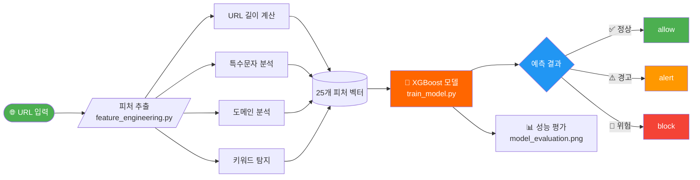

# 🛡️ IS_NetShield
### 지능형 유해 URL 실시간 탐지 시스템

<p align="center">
  
  
  
  
  
</p>

<p align="center">
  악성 URL을 머신러닝으로 실시간 분석·차단하는 보안 시스템
</p>

---

## 🔄 시스템 파이프라인



---

## 🗂️ 프로젝트 구조

```
IS_NetShield/
├── 📁 src/
│   ├── 🔧 feature_engineering.py   # URL → 피처 추출
│   ├── 🤖 train_model.py           # XGBoost 학습 및 평가
│   └── 🚀 api_server.py            # FastAPI 서버 (예정)
├── 📁 data_mal/
│   ├── 📄 malicious_phish.csv      # 정상/악성 혼합 URL 데이터셋 (Kaggle)
│   └── 📄 online-valid.csv         # 실시간 피싱 URL (PhishTank, 비교 검증용)
├── 📁 model/
│   └── 💾 xgb_model.pkl            # 학습된 모델
├── 📁 results/
│   └── 📊 model_evaluation.png     # 모델 평가 결과 시각화
├── 🚫 .gitignore
└── 📖 README.md
```

---

## 🚀 시작하기

### 1️⃣ 패키지 설치

```bash
pip install xgboost scikit-learn pandas numpy matplotlib seaborn requests
```

### 2️⃣ 데이터셋 다운로드

Kaggle에서 `malicious_phish.csv` 다운로드:  
🔗 https://www.kaggle.com/datasets/sid321axn/malicious-urls-dataset

> 컬럼: `url`, `type` (benign / phishing / malware / defacement)

### 3️⃣ 모델 학습

```bash
python train_model.py
```


---

## 📊 모델 성능 결과


학습 데이터: **651,191개** (Kaggle Malicious URL Dataset)  
테스트 데이터: **130,239개** (전체의 20%)

| 지표 | 수치 |
|:----:|:----:|
| Accuracy | 0.9408 |
| Precision | 0.9006 |
| Recall | 0.9296 |
| **F1 Score** | **0.9149** |
| **ROC-AUC** | **0.9860** |
| False Positive Rate | 0.0534 |

### Confusion Matrix 해석

| | 예측 정상 | 예측 악성 |
|:--:|:--:|:--:|
| 실제 정상 | 81,045 ✅ | 4,576 ❌ |
| 실제 악성 | 3,140 ❌ | 41,478 ✅ |

- 오탐 (정상 → 악성): 4,576건 (5.3%)
- 미탐 (악성 → 정상): 3,140건 (7.0%)

### Feature Importance Top 5

| 순위 | 피처 | 의미 |
|:----:|------|------|
| 1 | domain_length | 악성 URL은 도메인이 길다 |
| 2 | has_www | www 없이 이상한 서브도메인 사용 |
| 3 | subdomain_depth | 서브도메인이 깊을수록 의심 |
| 4 | path_depth | 경로가 복잡할수록 의심 |
| 5 | tld_risk | .tk .xyz 등 고위험 TLD 사용 |

---

## 🧪 추출 피처 목록 (25개)

| 카테고리 | 피처 |
|:-------:|------|
| 📏 **URL 길이** | `url_length`, `domain_length`, `path_length`, `query_length` |
| 🔣 **특수문자** | `count_dots`, `count_hyphens`, `count_at`, `count_percent` 등 |
| 🌍 **도메인** | `subdomain_depth`, `has_ip_address`, `tld_risk` |
| 🔒 **프로토콜** | `is_https` |
| 🔍 **키워드** | `has_phishing_keyword`, `has_brand_keyword` |
| 🧩 **패턴** | `has_typosquatting`, `has_double_slash` |
| 📐 **통계** | `url_entropy`, `digit_ratio`, `path_depth` |

---

## ⚖️ 비교 대상 (Optioanl/예정)

| 모델 | 특징 | 유형 |
|:----:|------|:----:|
| 🥇 **우리 모델** | XGBoost + 25개 피처 엔지니어링, 로컬 추론 | Local ML |
| 🔵 **Google Safe Browsing** | 업계 표준, 무료 API | Cloud API |
| 🟠 **VirusTotal** | 70개 엔진 앙상블, 정답지로 활용 | Cloud API |

---

## 🔌 API 서버 (예정)

> FastAPI 기반 REST API 서버를 구축하여 실시간 URL 탐지 서비스를 제공할 예정입니다.

```bash
# 패키지 설치
pip install fastapi uvicorn

# 서버 실행
uvicorn api_server:app --reload --host 0.0.0.0 --port 8000
```

### 예정 엔드포인트

| 메서드 | 경로 | 설명 |
|:------:|------|------|
| POST | `/analyze` | 단일 URL 분석 |
| POST | `/analyze/batch` | 다수 URL 일괄 분석 (최대 100개) |
| GET | `/health` | 서버 상태 확인 |
| GET | `/stats` | 모델 정보 조회 |

### 응답 예시

```json
{
  "url": "http://paypa1-secure.xyz/login/verify",
  "score": 99,
  "verdict": "block",
  "label": "위험",
  "reasons": ["피싱 키워드 포함", "고위험 TLD 도메인", "HTTP 비암호화"],
  "response_time_ms": 12.4,
  "timestamp": "2026-04-03T18:00:00"
}
```

---

## ☁️ AWS 배포 아키텍처 (예정)

> EC2 + ALB + WAF 조합으로 실제 보안 경계를 구성할 예정입니다.

```
사용자 / 가상 공격자
        ↓
  Route 53 (DNS)
        ↓
  ALB (로드 밸런서)
        ↓
  AWS WAF (1차 룰 기반 차단)
        ↓
  EC2 탐지 엔진 (FastAPI + XGBoost)
        ↓
  S3 (로그 저장) + CloudWatch (모니터링)
```

### 예정 구성 요소

| 서비스 | 역할 |
|--------|------|
| EC2 | FastAPI 서버 + XGBoost 모델 호스팅 |
| ALB | 트래픽 분산 및 HTTPS 처리 |
| AWS WAF | IP 차단, 알려진 악성 패턴 1차 필터링 |
| S3 | 탐지 로그 및 모델 아티팩트 저장 |
| CloudWatch | 실시간 모니터링 및 알람 |

---

## 🗺️ 개발 로드맵

```
✅ 1단계  ML 모델 학습 및 평가     — 완료
🔄 2단계  FastAPI 서버 구축        — 진행 예정
⏳ 3단계  AWS 배포 (EC2+ALB+WAF)  — 진행 예정
⏳ 4단계  React 대시보드 UI        — 진행 예정
```

---

<p align="center">
  <sub>🔐 보안 프로젝트 | Information Security Class</sub>
</p>
