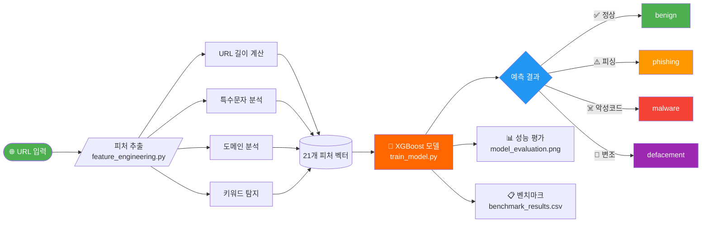

# 🛡️ IS_NetShield
### 지능형 유해 URL 실시간 탐지 시스템

<p align="center">
  
  
  
  
  
</p>

<p align="center">
  악성 URL을 머신러닝으로 실시간 분석·차단하는 보안 시스템
</p>

---

## 🔄 시스템 파이프라인



---

## 🗂️ 프로젝트 구조

```
IS_NetShield/
├── 📁 src/
│   ├── 🔧 feature_engineering.py   # URL → 피처 추출
│   └── 🤖 train_model.py           # XGBoost 학습 및 평가
├── 📁 data_mal/
│   ├── 📄 malicious_phish.csv      # 정상/악성 혼합 URL 데이터셋 (Kaggle), 사용
│   └── 📄 online-valid.csv         # 악성 URL 데이터셋 (phsing tank), 필요시 비교 검증에 사용예정
├── 📁 model/
│   └── 💾 xgb_model.pkl            # 학습된 모델
├── 📁 results/
│   ├── 📊 model_evaluation.png     # 모델 평가 결과 시각화
│   └── 📋 benchmark_results.csv   # 성능 비교 결과
├── 🚫 .gitignore
└── 📖 README.md
```

---

## 🚀 시작하기

### 1️⃣ 패키지 설치

```bash
pip install xgboost scikit-learn pandas numpy matplotlib seaborn requests
```

### 2️⃣ 데이터셋 다운로드

Kaggle에서 `malicious_phish.csv` 다운로드:  
🔗 https://www.kaggle.com/datasets/sid321axn/malicious-urls-dataset

> 컬럼: `url`, `type` (benign / phishing / malware / defacement)

### 3️⃣ 피처 추출 확인

```bash
python 1_feature_engineering.py
```

### 4️⃣ 모델 학습

```bash
# 실제 데이터 사용 시 train_model.py 상단 load_sample_data() → load_dataset() 교체
python 2_train_model.py
```


### 5️⃣ 벤치마크 실행 (API 키 선택사항)

```bash
export GOOGLE_SAFE_BROWSING_API_KEY="your_key_here"
export VIRUSTOTAL_API_KEY="your_key_here"
python 3_benchmark.py
```

---

## 🧪 추출 피처 목록 (21개)

| 카테고리 | 피처 |
|:-------:|------|
| 📏 **URL 길이** | `url_length`, `domain_length`, `path_length`, `query_length` |
| 🔣 **특수문자** | `count_dots`, `count_hyphens`, `count_at`, `count_percent` 등 |
| 🌍 **도메인** | `subdomain_depth`, `has_ip_address`, `tld_risk` |
| 🔒 **프로토콜** | `is_https` |
| 🔍 **키워드** | `has_phishing_keyword`, `has_brand_keyword` |
| 🧩 **패턴** | `has_typosquatting`, `has_double_slash` |
| 📐 **통계** | `url_entropy`, `digit_ratio`, `path_depth` |

---

## ⚖️ 비교 대상(Additional)

| 모델 | 특징 | 유형 |
|:----:|------|:----:|
| 🥇 **우리 모델** | XGBoost + 21개 피처 엔지니어링, 로컬 추론 | Local ML |
| 🔵 **Google Safe Browsing** | 업계 표준, 무료 API | Cloud API |
| 🟠 **VirusTotal** | 70개 엔진 앙상블, 정답지로 활용 | Cloud API |

---

## 🗺️ 개발 로드맵

```
✅ 1단계  ML 모델 학습 및 평가
🔄 2단계  4_api_server.py      — FastAPI 서빙
⏳ 3단계  5_aws_deploy/        — EC2 + ALB + WAF 배포
⏳ 4단계  6_ui/                — React 대시보드
```

---

<p align="center">
  <sub>🔐 보안 프로젝트 | Information Security Class</sub>
</p>
